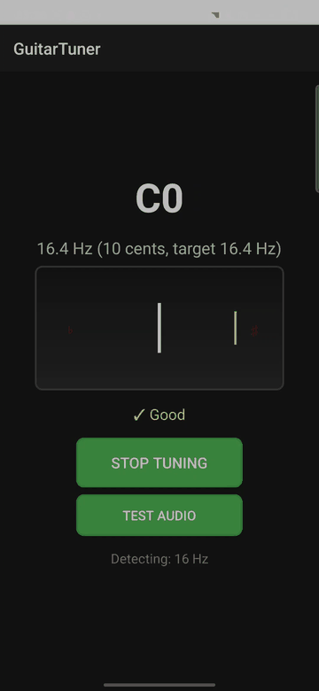

# Bleat Guitar Tuner


Bleat Guitar Tuner is an Android guitar tuner with on-device pitch detection, cents-based tuning feedback, and a deliberately testable core. The original goal of the project was straightforward: build a tuner that is actually pleasant to use, with no ads and no nags to unlock basic functionality behind paywalls. The repository is structured to be readable as a portfolio project: the signal-processing logic lives in pure Kotlin classes, the Android shell is thin, and the project is set up for CI-backed verification.

Get the app on Google Play: <https://play.google.com/store/apps/details?id=com.whawe.guitartuner>

## Demo



## Highlights

- Real-time pitch detection using a YIN-style estimator over PCM microphone input
- Chromatic note mapping with cents deviation and a continuous tuner needle
- Adaptive smoothing to stabilize noisy real-world readings without sticking
- A scale-practice page with root/scale selection and a live highlighting stave
- Demo fallback for environments where microphone capture is unavailable
- No ads, no in-app upsell flow, and no locked "premium" tuning features
- Local-only processing with no network permission and no analytics

## Architecture

- `MainActivity` owns Android lifecycle, permission handling, and view binding
- `ScalePracticeActivity` reuses live pitch detection for scale drilling on a stave
- `AudioRecordFactory` centralizes `AudioRecord` setup shared by both listening screens
- `PitchDetector` implements the YIN-style pitch estimator over raw `ShortArray` PCM frames
- `FrequencySmoother` applies adaptive log-scale smoothing for stable but responsive note presentation
- `NoteMapper` converts detected frequencies into note names and target frequencies
- `TuningFeedbackEvaluator` maps cents deviation into user-facing tuning states
- `ScaleLibrary` and `ScaleStaveView` handle scale generation and notation rendering

More detail is in [docs/ARCHITECTURE.md](docs/ARCHITECTURE.md).

## Testing

The test strategy focuses on deterministic coverage of the logic that matters most:

- note mapping and cents calculations
- adaptive smoothing behavior
- threshold-based tuning feedback
- synthetic PCM regression tests for multiple reference pitches and sample rates

Current unit tests live under [`app/src/test/java/com/whawe/guitartuner/tuning`](app/src/test/java/com/whawe/guitartuner/tuning). The remaining release work is tracked in [docs/PUBLIC_RELEASE_CHECKLIST.md](docs/PUBLIC_RELEASE_CHECKLIST.md).

Connected Android tests now live under [`app/src/androidTest/java/com/whawe/guitartuner`](app/src/androidTest/java/com/whawe/guitartuner). They cover the initial render, microphone-permission grant and denial flows, and the resulting start/stop control transitions on an emulator.

## Local Development

Validated build runtime: JDK 17.

The project currently targets a JDK 17 Gradle runtime. A `.java-version` file is included so local tooling can pin the same version used in CI.

```bash
./gradlew testDebugUnitTest
./gradlew lintDebug
./gradlew assembleDebug
./gradlew connectedDebugAndroidTest
```

To install on a connected device or emulator:

```bash
./gradlew installDebug
adb shell am start -n com.whawe.guitartuner/.MainActivity
```

## Build and Release Notes

- Release signing is environment-driven through `GT_SIGN_STORE`, `GT_SIGN_STORE_PASS`, `GT_KEY_ALIAS`, and `GT_KEY_PASS`
- CI is defined in [`.github/workflows/android.yml`](.github/workflows/android.yml)
- Play Store preparation notes live in [docs/PLAY_STORE_RELEASE.md](docs/PLAY_STORE_RELEASE.md)
- Design-source artwork lives under [`docs/assets/design-source`](docs/assets/design-source)

## Privacy

The app requests microphone access for local pitch detection only. It does not require internet access and does not collect analytics or personal data.

- Markdown policy: [PRIVACY_POLICY.md](PRIVACY_POLICY.md)
- Static privacy page source: [index.html](index.html)

## Repository Status

This pass cleaned up local-only artifacts, removed placeholder tests/docs, added a license, introduced CI, extracted the core tuning logic into testable modules, added instrumentation coverage, and moved design-source assets out of the repo root. The remaining work before a polished public launch is documented in [docs/PUBLIC_RELEASE_CHECKLIST.md](docs/PUBLIC_RELEASE_CHECKLIST.md).
